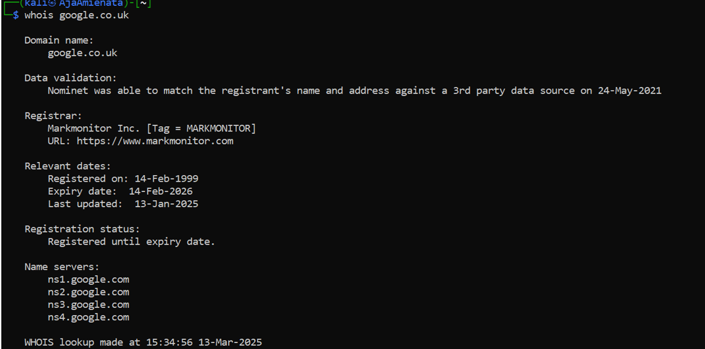
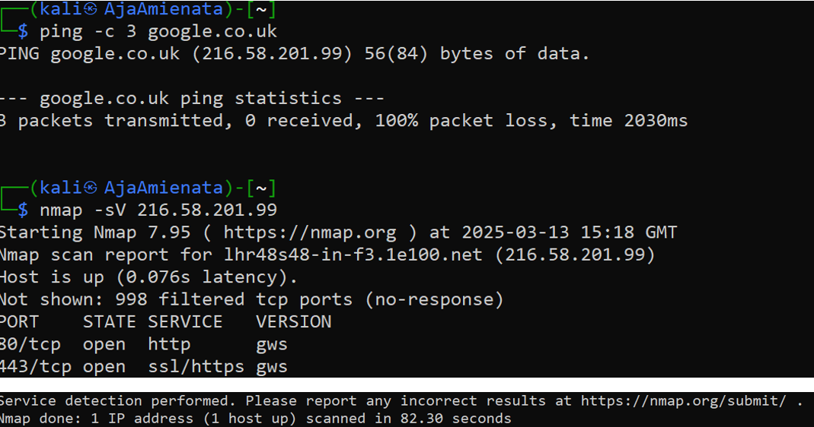

# Network Reconnaissance & Footprinting

This project demonstrates passive and active reconnaissance techniques using **WHOIS** and **Nmap**. It shows how information about domains and services can be gathered, and discusses how defenders detect and mitigate such activity.

---

## Tools Used
- Nmap
- WHOIS
- Linux command line (Kali/Ubuntu)

---

## Objective
- Use WHOIS to gather domain ownership information  
- Use Nmap to identify open ports and services  
- Consider how such activity is detected and mitigated by defenders  

---

## Example Commands
```bash
whois example.com
nmap -sS -Pn example.com

---

## Screenshots






---

## Detection & Mitigation
- **Detection:** IDS/IPS, SIEM logs, DNS/WHOIS monitoring  
- **Mitigation:** Rate-limiting, honeypots, firewalls, WHOIS privacy services  

---

## What I Learned
- WHOIS queries are passive and rarely detected  
- Nmap scans are often blocked or flagged by IDS/IPS  
- Defensive controls are essential to limit exposure  

---


## Ethical Note
This project was carried out in a safe and authorised environment.  
Do not scan systems without explicit permission.

